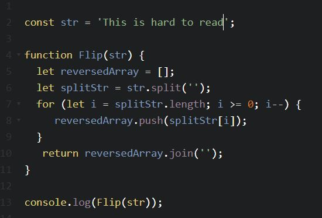
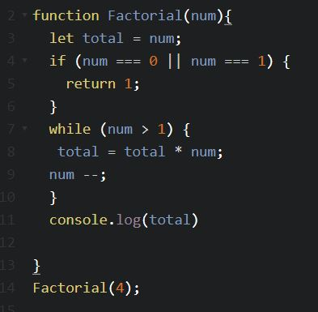
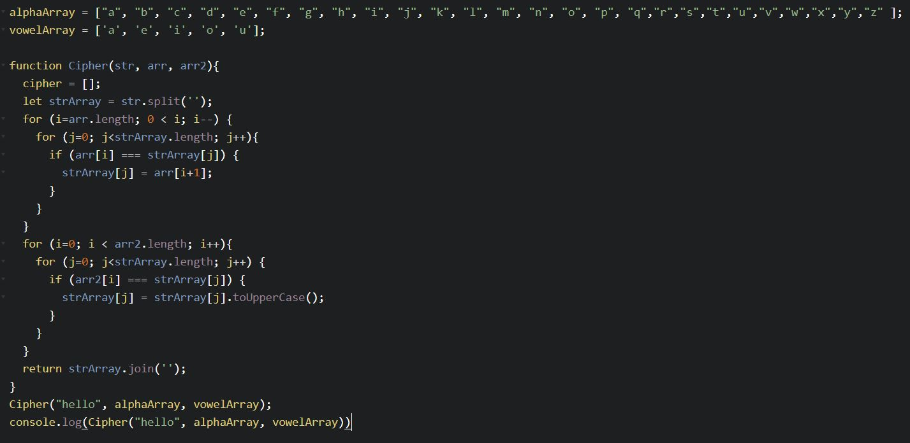

## Ted Leary's Self Assessment ##

#### Is there anything about the general job search and internship interview process you feel unprepared for? What would make you feel more comfortable and confident in your job search and internship interviews? ####

* My only general anxiety about the job application and interview process is that I am relying more or less solely on Epicodus for my technical background. Some of our Wednesday speakers have mentioned coming into the programming world with little to no experience though and obviously they made it work, so that gives me confidence.
  I think what would make me more confident in the job search and internship interviews is a more concrete grasp of computer science concepts and an "ordering" of knowledge in my head. I feel that I've learned so much so fast that it can be difficult to articulate a concept in a way that makes sense to others. I know generally what it does, but can I explain it in a way that is clear and concise? Not as frequently as I'd like.

#### Is there anything about searching for and transitioning into your future career a technical field that you feel unprepared for? What would make you feel more comfortable and confident in this process? ####

* I feel a little unprepared in regards to the mathematics inherent in programming. I have a pretty lousy math background and math concepts don't come easy. I think if I spend some time doing Khan Academy courses as well as continue with more algorithm practice in JavaScript I'd feel more confident. Aside from that I'm more excited than anxious.

## The Plan ##

1. Go over the interview questions section of Learnhowtoprogram.com and answer them to the best of my ability in a google doc. Turn the information from this doc into a flashcard app in React.
2. Make time to do JavaScript algorithm challenges on freecode.camp or another similar site.
3. Finish my portfolio website in React.
4. Brush up on math concepts at Khan Academy.
5. Continue focusing on React and solidifying my understanding of its function.

## Work ##

1. I started by finishing off a hide/show function in my profile page using a state toggle in React, courtesy of this tutorial https://reactjs.org/docs/handling-events.html --NOTE: I spent nearly an hour thinking I was screwing up the bind for my event handler, real problem was accidental capital 'L' in 'handleCLick'.

- Uploaded screenshot of ContactCard component after researching setState, prevState, binding and seperating 'ContactInfo' into a separate component. The onClick now toggles the rendering of ContactInfo on and off with a fancy drop down and fade in effect.

2. Moving on to researching interview questions. -added answers for about a dozen questions, moving on to technical JS challenges at top of google doc - https://docs.google.com/document/d/1YkmR-_SIhd1LoZJUwU8iDSGl1a6M2ZniAtB6T9fKISo/edit?usp=sharing

- Solved first challenge - Definitely a few ways to do this one, also the prompt said to return the string in reverse order, in an interview situation it would have been good to clarify whether they wanted the words in backwards order or the letters. 'hey how are you' = 'you are how hey' OR 'hey how are you' = 'ouy era woh yeh'

- Solved the second

- and the third - just noticed the unnecessary leftover 'cipher' array. whoops. - There's probably a much cleaner way to do this with the key value pairs thing we discussed the other day. I'll make note to look into that.

## Reflection and Next Steps ##

#### Do you feel like you made improvement today? Are you more confident and comfortable in one or more areas? Why or why not? ####

* I felt like today was very productive. I feel better about dealing with state in react and I think learning that simple 'switch' method is going to be a huge help later on. I felt a lot more confident after going through those three JS challenges. Since the end of the JS module at Epicodus I've been concerned that I'd forgotten a lot of it but I think I've retained more than I thought.
Slogging away through that study material helps solidify everything bit by bit.

#### Where are you at now? What are your next steps? What do you still need to accomplish to feel confident and prepared to begin your eventual job search? ####

I feel like I need to continue more or less on the same trajectory. I still need to look into the internship options and determine which ones I prefer over the others. It would definitely be worth it to look into local tech concerns in general and get a feel for what kind of work is going on here in Portland.

I should definitely attend some meet ups. Other than that I feel like I just need to keep growing my base of knowledge and get more comfortable with the technologies I've already been introduced to.
